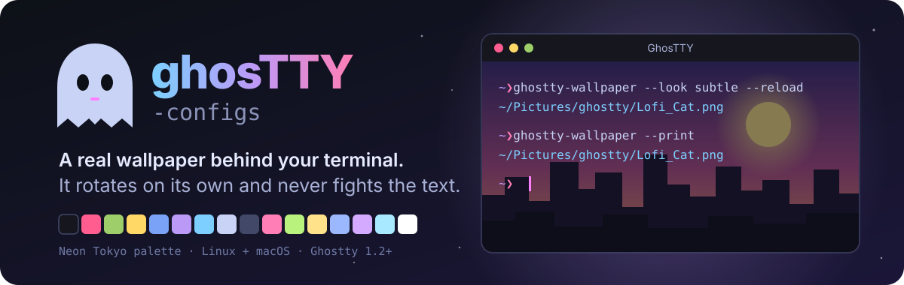
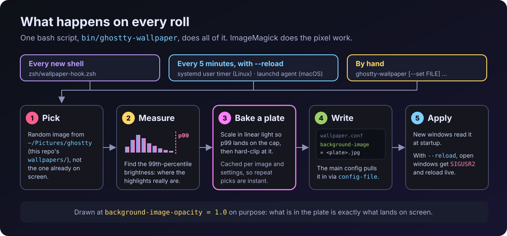
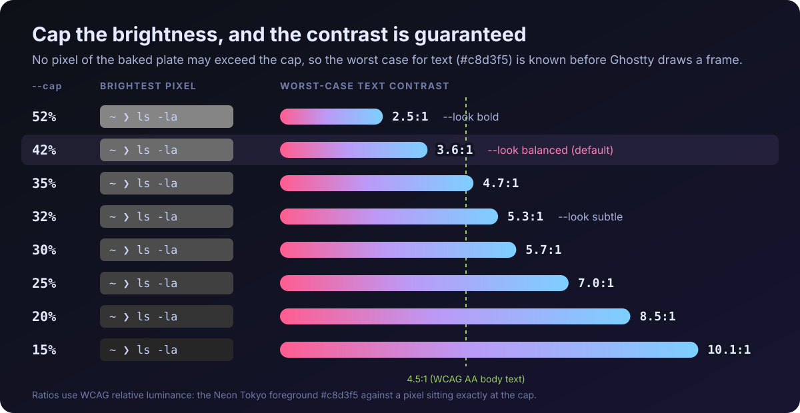

<p align="center">
  
</p>

<p align="center">
  <b>A <a href="https://ghostty.org">Ghostty</a> setup with a real wallpaper behind the terminal that rotates on its own and never fights your text.</b><br>
  One install script. 27 wallpapers included. Readable text on every one of them, with the maths to prove it.
</p>

<p align="center">
  <a href="https://ghostty.org"></a>
  <a href="#platforms"></a>
  <a href="#requirements"></a>
  <a href="bin/ghostty-wallpaper"></a>
</p>

---

## Why

A photo behind terminal text is a contrast problem. Bright skies, neon signs and blown-out
highlights swallow whatever glyph lands on them, and Ghostty's own `minimum-contrast`
[doesn't apply to images](#troubleshooting), so it can't save you.

This repo solves it once, before Ghostty ever sees the image: every wallpaper is
**brightness-capped and baked into a "plate"**, so no pixel can get bright enough to hurt
your text. Then it keeps things fresh:

- **New wallpaper in every new window.** A zsh hook re-rolls on each shell.
- **Rotates every 5 minutes, live.** Open windows reload in place, no keypress.
- **Neon Tokyo theme** with FantasqueSansM and Victor Mono italics, ligatures on.
- **Symlinked, not copied.** Edit the live config and `git diff` shows exactly what changed.

## How it works

<p align="center">
  
</p>

Each image is rescaled **in linear light** so its 99th-percentile brightness lands on a
ceiling (the *cap*), then hard-clipped there. The result is cached in
`~/.cache/ghostty-wallpaper/plates`, so a repeat pick costs one file read.

Because nothing in the plate can exceed the cap, the worst-case text contrast is known
in advance instead of hoped for:

<p align="center">
  
</p>

> [!TIP]
> The default look is **balanced** (cap 42%). If you spend long sessions reading dense
> output, `ghostty-wallpaper --look subtle` or `--cap 30` pushes text past 4.5:1 on every image.

## Quick start

```sh
git clone https://github.com/root-luffy/ghosTTY-configs.git
cd ghosTTY-configs
./install.sh
```

Then open a new Ghostty window. That's it: it's meant to work on a fresh clone with no
manual steps.

> [!NOTE]
> The 27 bundled wallpapers are about 150 MB, so the clone is on the heavy side.

### What `install.sh` does

| Step | What happens |
| --- | --- |
| Config | Symlinks `config` and both shaders into `~/.config/ghostty`. |
| Tool | Symlinks `bin/ghostty-wallpaper` into `~/.local/bin`. |
| Images | Symlinks `wallpapers/` to `~/Pictures/ghostty`, so the first roll already has images. |
| Timer | Enables a 5-minute rotation: a **systemd user timer** on Linux, a **launchd agent** on macOS (picked via `uname`). |
| Shell | Adds one line to `~/.zshrc` that re-rolls on every new shell (skipped if it's already there). |

Anything already at one of those paths is **backed up as `<name>.bak-<timestamp>`**, never
overwritten. Re-running the installer is safe: links that already point here are left alone.

### Requirements

- [Ghostty](https://ghostty.org) **1.2 or newer** (live reload uses `SIGUSR2`, which Ghostty handles since 1.2). Tuned on 1.3.x.
- **ImageMagick** (`magick`) for the brightness work: `brew install imagemagick` on macOS, `sudo pacman -S imagemagick` on Arch, or your distro's package.
- Fonts: **FantasqueSansM Nerd Font Mono** and **Victor Mono**. A JetBrains Mono block is ready to swap in, commented out in `config`.
- **zsh** for the per-shell re-roll. Other shells work; they just skip that one hook.

Nothing else. `pgrep` and `kill` are already on both platforms.

## Commands

```sh
ghostty-wallpaper                    # re-roll
ghostty-wallpaper --reload           # re-roll and apply to already-open windows
ghostty-wallpaper --look subtle      # preset: bold (52%) / balanced (42%) / subtle (32%)
ghostty-wallpaper --cap 25 --reload  # custom brightness cap, applied live
ghostty-wallpaper --set FILE         # pin one image
ghostty-wallpaper --off              # no background image
ghostty-wallpaper --print            # what's showing now
ghostty-wallpaper --prepare          # pre-build every plate so rolls stay instant
ghostty-wallpaper --dark             # only dark images (mean luma <= 0.30)
ghostty-wallpaper --all              # ignore the brightness filter
ghostty-wallpaper --opacity N        # pin background-image-opacity (0.0-1.0)
ghostty-wallpaper --reindex          # rebuild the brightness cache
ghostty-wallpaper --help             # full usage
```

The zsh hook also adds a short alias: `gwall`.

`--cap`, `--look` and `--opacity` are **remembered** across rolls and reboots. `--cap` wins
until you set a `--look`, which clears the custom cap and opacity and hands control back to
that preset.

<details>
<summary><b>Environment overrides</b></summary>

| Variable | Effect |
| --- | --- |
| `GHOSTTY_WALLPAPER_DIR` | Force one image folder (the dark-only filter applies by default). |
| `GHOSTTY_WALLPAPER_CURATED_DIR` | Curated folder, default `~/Pictures/ghostty`. |
| `GHOSTTY_WALLPAPER_LOOK` | `bold`, `balanced` or `subtle`. |
| `GHOSTTY_WALLPAPER_CAP` | Brightness cap, percent of white. |
| `GHOSTTY_WALLPAPER_BLUR` | Blur radius at 2560px wide. Default `0`: nothing is blurred. |
| `GHOSTTY_WALLPAPER_OPACITY` | Pin `background-image-opacity`. |
| `GHOSTTY_WALLPAPER_MAX_LUMA` | Threshold for "dark" images, default `0.30`. |

</details>

### Where images come from

`~/Pictures/ghostty` (the repo's `wallpapers/`) whenever it holds any images. Those are used
as-is, since you picked them on purpose. If it's empty, the tool falls back to
`~/Pictures/wallpapers`, filtered to dark images only.

To add your own, just drop them into `wallpapers/` (`.png`, `.jpg`, `.jpeg` or `.webp`).
The next roll picks them up, nothing to configure.

## Keybinds

| Keys | Action |
| --- | --- |
| <kbd>Ctrl</kbd> + <kbd>&#96;</kbd> | Toggle the quick dropdown terminal |
| <kbd>Ctrl</kbd> + <kbd>Shift</kbd> + <kbd>\\</kbd> | Split right |
| <kbd>Ctrl</kbd> + <kbd>Shift</kbd> + <kbd>-</kbd> | Split down |
| <kbd>Ctrl</kbd> + <kbd>Shift</kbd> + <kbd>H</kbd> <kbd>J</kbd> <kbd>K</kbd> <kbd>L</kbd> | Move between splits (vim directions) |
| <kbd>Ctrl</kbd> + <kbd>Shift</kbd> + <kbd>Enter</kbd> | Zoom the current split |
| <kbd>Ctrl</kbd> + <kbd>Shift</kbd> + <kbd>O</kbd> | Tab overview |
| <kbd>Ctrl</kbd> + <kbd>Shift</kbd> + <kbd>R</kbd> | Reload config (picks up the latest wallpaper) |
| <kbd>Ctrl</kbd> + <kbd>Shift</kbd> + <kbd>,</kbd> | Open the config |

## Shaders

Two optional shaders ship in `shaders/`, both **off by default**. Uncomment one
`custom-shader` line in `config` to try it:

| Shader | Look |
| --- | --- |
| `glow.glsl` | Subtle neon bloom on bright text. Off because it softened text too much. |
| `crt.glsl` | Retro CRT: gentle scanlines and a vignette, tuned to stay readable. |

## Platforms

**Linux and macOS both work**, including macOS's stock `/bin/bash` 3.2. GNU vs. BSD tool
differences (`stat`, `md5sum`, `find`) are handled inside the script.

The only platform-specific pieces are the rotation timer (systemd vs. launchd, handled by
the installer) and two `config` keys, `gtk-single-instance` and `gtk-tabs-location`, which
Ghostty ignores outside its GTK/Linux build. The same `config` works unmodified on both.

- **Linux:** developed on EndeavourOS (Arch), Wayland, zsh + oh-my-zsh + starship, Ghostty 1.3.x.
- **macOS:** written from Ghostty's macOS documentation and its cross-platform `SIGUSR2`
  reload, but **not yet tested on real Mac hardware**. Reports welcome.

## Troubleshooting

<details>
<summary><b>macOS: my config changes don't show up</b></summary>

Ghostty on macOS prefers `~/Library/Application Support/com.mitchellh.ghostty/config` over
`~/.config/ghostty/config` *if* that folder already has files in it, for example from using
the in-app Settings first. Move anything out of that folder, then run `./install.sh` again.
On a fresh Ghostty install there's nothing there and no extra step is needed.
</details>

<details>
<summary><b>"ImageMagick (magick) not found"</b></summary>

Install ImageMagick (see [Requirements](#requirements)). The error comes from the dark-image
filter (`--dark`, or the `~/Pictures/wallpapers` fallback); `--all` skips it. Without ImageMagick,
images can't be brightness-capped and are shown unprocessed at a low opacity instead.
</details>

<details>
<summary><b>The first roll is slow</b></summary>

Each image's plate is built the first time it's picked, and a filtered folder is measured
once up front (about a minute). Run `ghostty-wallpaper --prepare` once to build every plate
up front; it also prunes plates left over from old looks. Expect about 1 MB per plate.
</details>

<details>
<summary><b>I want the see-through window back</b></summary>

`background-opacity` is `1.0` on purpose: with a background image, transparency stacks the
desktop *and* whatever window is behind Ghostty under your text. Set it back to `0.92` in
`config` if you prefer the glassy look.
</details>

<details>
<summary><b>Why not just use <code>minimum-contrast</code>, blur, or a shader?</b></summary>

All three were tried:

- **`minimum-contrast`** compares text against the background *colour*. Ghostty's docs say it
  "does not apply to Emoji or images", so it never looks at the wallpaper.
- **Blur** hurts more than it helps. It's what makes a wallpaper stop looking like itself,
  and the thing actually swallowing text is blown-out highlights, not fine detail.
- **A shader that darkens around glyphs** can't cleanly tell a glyph from photo detail:
  detecting by brightness does nothing on bright images, and detecting by structure fires
  on every cloud edge.

Capping brightness in the file is unglamorous, but it's the only one that's predictable.
The plate is also drawn at `background-image-opacity = 1.0`, because a measured frame came
out brighter than the opacity maths predicted. Baked in, what's in the plate is what's on screen.
</details>

## Stop or uninstall

Stop the rotation (per-window rolls and manual use keep working):

```sh
systemctl --user disable --now ghostty-wallpaper.timer              # Linux
launchctl bootout gui/$(id -u)/com.luffy.ghostty-wallpaper          # macOS
```

To remove everything, also delete the symlinks `install.sh` created (listed
[above](#what-installsh-does)), the `wallpaper-hook.zsh` line in `~/.zshrc`, and
`~/.cache/ghostty-wallpaper`. Restore any `*.bak-<timestamp>` backups you want back.

## Project layout

```
ghosTTY-configs/
├── config                         main Ghostty config (Neon Tokyo theme, fonts, keybinds)
├── install.sh                     symlinks everything into place, enables the timer
├── bin/
│   └── ghostty-wallpaper          the wallpaper tool: pick, measure, bake, apply
├── shaders/
│   ├── glow.glsl                  neon bloom (off by default)
│   └── crt.glsl                   retro CRT (off by default)
├── systemd/                       5-minute rotation timer (Linux)
├── launchd/                       5-minute rotation agent (macOS)
├── zsh/
│   └── wallpaper-hook.zsh         re-roll on every new shell
├── wallpapers/                    the curated image set (27 images)
└── assets/                        README illustrations
```

## Contributing

Issues and pull requests are welcome, especially **macOS test reports**, since that path
hasn't run on real hardware yet. If something breaks, include your OS, Ghostty version and
the output of `ghostty-wallpaper --print`.

## License

Not yet specified.
